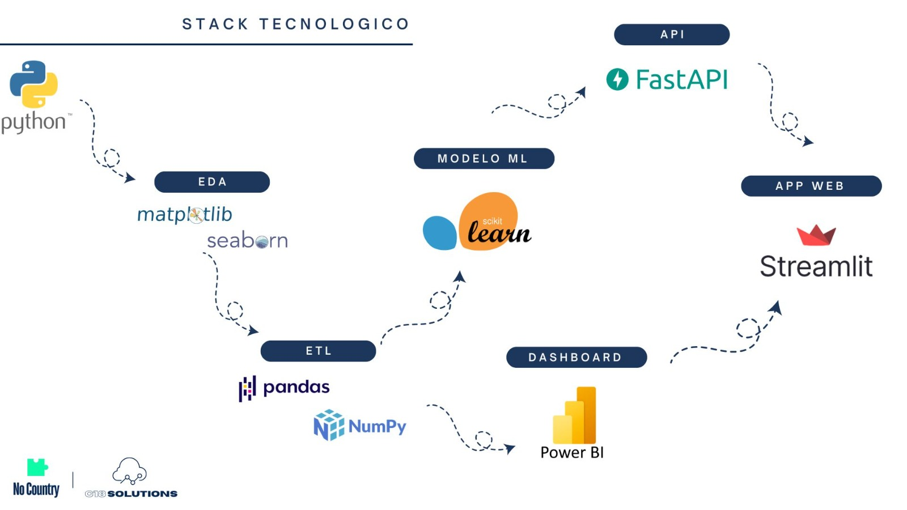

# Safe Money for Everyone 

## Introducción

## Contexto

## Objetivo

## Stack Tecnológico
- Python (compatible con versiones 3.9 en adelante)
- Jupyter
- Poetry ([Tutorial](./docs/README_poetry.md))
- Scikit-learn
- Pandas
- NumPy
- Matplotlib
- Seaborn
- Power BI
- FastAPI
- Streamlit

## Flujo de Trabajo

## Integrantes

### Team Data Science / Machine Learning
- José Huautla - Team Leader
- Patricio Marzi
- Romina Fora

### Team Data Analytics
- Milagros Torres - Team Leader
- Daniela Plaza
- Johana Sanchez

### Team Data Engineering
- Agustín Jerez

### Project Manager
- Milagros Torres
