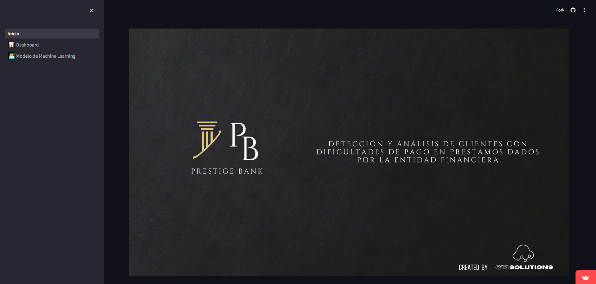

# <h1 align=center> **Detección de Clientes con Dificultad de Pago** </h1>

## Introducción

En la era digital, las instituciones financieras están adoptando cada vez más soluciones basadas en datos para mejorar la toma de decisiones y mitigar riesgos. Este proyecto presenta una aplicación de machine learning diseñada para predecir la probabilidad de que un cliente bancario tenga dificultades de pago en sus préstamos. Utilizando un modelo de regresión logistica, este sistema permite a los bancos anticipar problemas y tomar medidas preventivas adecuadas para minimizar las pérdidas financieras; como así también, analizar en detalle el perfil y el estado financiero de cada cliente a través de un dashboard interactivo.

## Contexto

El proyecto se desarrolla en el contexto de una entidad financiera (Prestige Bank) que busca mejorar su capacidad de gestión del riesgo crediticio. Tradicionalmente, los bancos han evaluado el riesgo crediticio basándose en métodos cualitativos y cuantitativos clásicos. Sin embargo, con la disponibilidad de grandes volúmenes de datos y los avances en machine learning, es posible construir modelos predictivos más precisos y automatizados.

Este sistema se construye utilizando datos históricos de clientes, que incluyen variables laborales y financieras. La plataforma desarrollada en Streamlit proporciona una interfaz intuitiva para que los analistas de riesgo puedan introducir datos de nuevos clientes y obtener instantáneamente una predicción de la probabilidad de dificultades de pago.

## Objetivo

El objetivo principal de este proyecto es desarrollar una aplicación web interactiva que integre tanto un dashboard interactivo para analizar en detalle el perfil crediticio de los clientes, como un modelo de machine learning capaz de predecir la probabilidad de dificultades de pago en clientes de la entidad financiera. Para lograr esto, nos hemos propuesto las siguientes metas específicas:

- **Recopilación y Análisis de Datos:** Obtener y analizar los datos históricos de los clientes, incluyendo variables financieras y comportamentales.

- **Desarrollo del Modelo:** Entrenar y validar un modelo de regresión logistica que pueda predecir la probabilidad de dificultades de pago.

- **Desarrollo del Dashboard Interactivo:** El dashboard proporcionará a los usuarios una vista integral y dinámica de la situación financiera de los clientes, facilitando una toma de decisiones más informada.

- **Implementación de la Aplicación:** Crear una interfaz interactiva utilizando Streamlit, donde los usuarios puedan ingresar datos de clientes y obtener predicciones en tiempo real.

Este proyecto no solo busca aportar valor a Prestige Bank mediante la reducción de riesgos, sino también demostrar el poder del análisis de datos y el machine learning en la toma de decisiones estratégicas dentro del sector financiero.

## Aplicación web

*Vista previa de la aplicación web:*

#### Página de inicio:

> En la página de inicio encontrara información general del banco y de la consultora que realizo el proyecto.

#### Página "Dashboard"

> En la página "Dashboard" encontrara el dashboard interactivo para analizar el perfil crediticio de los clientes.

#### Página Modelo de Machine Learning

> En la página "Modelo de Machine Learning" encontrara el modelo de Machine Learning para realizar las predicciones.

Desde el siguiente link, podra dirigirse a la aplicación web: [Aplicación web](https://proyectodetecciondificultadpago-bbpumkdonws7rpdwbrmmvf.streamlit.app/)

## Stack Tecnológico
- Python (compatible con versiones 3.9 en adelante)
- Jupyter
- Scikit-learn
- Pandas
- NumPy
- Matplotlib
- Seaborn
- Power BI
- Streamlit

## Flujo de Trabajo

## Integrantes

### Team Data Science / Machine Learning
- José Huautla - Team Leader
- Patricio Marzi
- Romina Fora

### Team Data Analytics
- Milagros Torres - Team Leader
- Daniela Plaza
- Johana Sanchez

### Team Data Engineering
- Agustín Jerez

### Project Manager
- Milagros Torres
