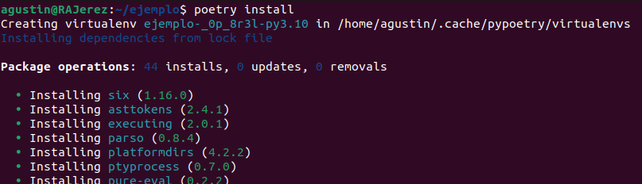
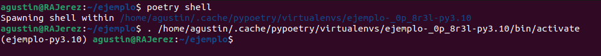
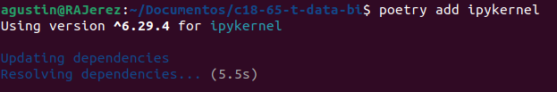
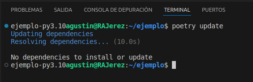
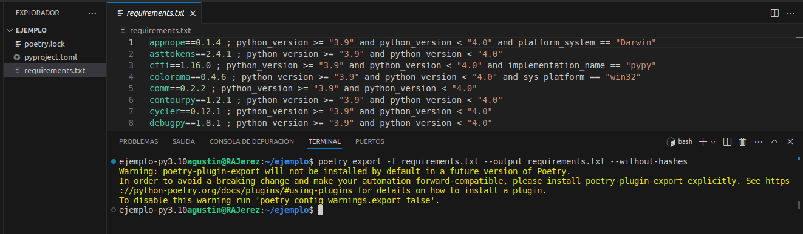
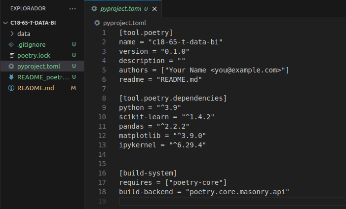

# Poetry
Poetry es una libreria que nos ayuda en el control automático de dependencias en proyectos de Python.

Ayuda en el desarrollo colaborativo, en este caso se configuró para que sea compatible con las versiones de python 3.9 en adelante. De todos modos se puede modificar.

## Instalación

#### 1- Uso de pipx
Es conveniente instalar poetry a traves de `pipx` (no pip). De esta manera ayuda a poetry a generar automaticamente un entorno virtual para cada proyecto.
    
    pip install pipx

#### 2- Instalar poetry

    pipx install poetry==1.7.1

Listo! Ya contamos con poetry instalado en nuestra maquina local.

## Entorno virtual e instalación de librerias

#### 1- Situarme en carpeta raiz del proyecto
Debo estar situado en la carpeta raiz del proyecto, el mismo donde se encuentran los archivos `pyproject.toml` y `poetry.lock`

    cd c18-65-t-data-bi

#### 2- Instalar dependencias
Al correr el siguiente comando, se creará automáticamente un entorno virutal y se instalarán las librerias en sus versiones adecuadas para evitar los conflictos de dependencias
    
    poetry install

El siguiente comando sirve para acceder a la terminal del entorno virtual

    poetry shell

## Agregar o quitar librerias

### Instalar una libreria en el entorno virtual

    poetry add numpy

### Quitar una libreria del entorno virtual

    poetry remove numpy

### Actualizar dependencias
Puede que mientras avance el proyecto volvamos a realizar un git pull del repositorio remoto y cuente con modificaciones en las dependencias

    poetry update

### Exportar las dependencias de poetry

Si prefieres trabajar con un archivo requirements.txt puedes correr este comando y automáticamente se creará
    
    poetry export -f requirements.txt --output requirements.txt --without-hashes

> [!NOTE]
>Es importante tener en cuenta que este requirementes exportado desde Poetry ya cuenta con las versiones especificas para evitar conflictos

### Archivo Pyproject
Este archivo contiene las configuraciones del entorno virtual
- Nombre del proyecto
- Versiones compatibles de Python
- Versiones exactas de librerias

    
